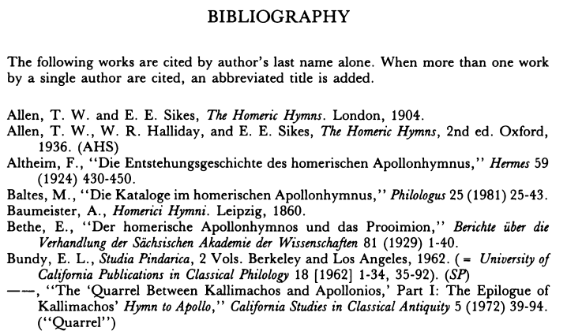
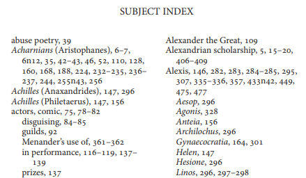

# From Books to Knowledge Graphs
The scientific publishing industry is rapidly transitioning towards information analytics. 
Researchers and scholars immensely benefit from the indexed content and provision of advanced search engines.
Unfortunately, digital transformation does not occur uniformly in all areas. 
The divide is acutely felt in the arts, humanities and social sciences (AHSS): the publishing ecosystem in these disciplines 
consists of many specialized businesses which cannot, individually, transform established practices and develop comparable services.

We propose to start bridging this gap by helping small and medium AHSS publishers to create **knowledge graphs** - the
technology underpinning modern scientific search engines. Their contents, largely made of books, already contain rich,
structured information – such as **references** and **indexes** – which we propose to automatically mine and interlink.

This project provides experimental software for extracting structured information and creating knowledge graphs
from it. 

## Input 
The entry point is a folder with one or more publication archives, e.g., 
```
data
│   archive_1.zip
│   ...
└───archive_k.zip 
   │   publication_1.zip
   │   ... 
   └───publicationb_m.zip 
       │   content_1.pdf
       │   content_2.pdf
       │   ...
       │   content_n.pdf
       │   full_text.pdf
       │   jats_structure.xml
```
Each publication is an archive of PDF files where each file contains some part of the content, i.e., 
chapter or semi-structured information such as bibliographic references or indices. Publication structure is usually 
defined in a JATS file (a standardized XML format used to describe scientific literature published online).      

## Publication structure
For each publication archive, we start from locating the XML file and extracting information about the publication: 
*title*, *contributors* (authors and/or editors), *publication year*, *publisher*, *doi* and *isbn* identifiers. 
Then we search for book parts that contain bibliographic references and index lists. These parts are not marked in any special way in our sample archives, so we rely on keywords 
*bibliography* and *index* in the book part title to source content files containing structured information.

Additionally, we classify index files based on a selection of title keywords typical for different types of indices. 
Currently, we recognize 9 index types: *verborum*, *locorum*, *nominum* (ancient and modern), *rerum*, *geographicus*, 
*bibliographicus*, *museum*, and *epigraphic*. Index type may be helpful in determining which parser to use to extract 
structured data from the index reference text. Some publications may contain highly specialized indices - it still may be possible 
to parse them using generic syntactic parsers we provide for commonly used formats, but in special cases a specialized parser should
be added to process unusual structures.

## Extracting references from PDF files
After locating PDF files with index and bibliographic references, we need to split the bulk data into individual references.
This is a daunting task due to the fact that PDF does not preserve logical structures such as sentences or paragraphs, it consists 
of instructions to position textual and graphical elements on paper. We use PDFMiner to extract text from PDF files and 
reconstruct some of those structures by relative positioning of its elements. The problem is made even harder by absence of uniform
formats: references can be placed in one or several columns, their parts can be separated by commas, different units of indent,
alignment, long references can spill into several lines or have nested structure with several sub-levels and relation to above content.

Our parser is based on the following observations:
- references constitute the majority of file content and have identical alignment;
- references that do not fit into one line may spill into the next line starting at the same level or with small 
indent wrt the starting position. 
 
The images below show an example of bibliography and index files. Observe that each bibliographic reference starts at the 
same horizontal position while its continuation on the next line is shifted wrt the starting position. 
The same holds for the index file as well with the difference that indices are arranges into two columns.     


 

Hence, we start by counting unique offsets for new lines (separately for odd and even pages). We then sort these offsets by frequency of 
occurrences and select starting positions as smallest most frequently used offsets that significantly differ from each other.
For example, if there are 100 lines with horizontal indent of 50 and 120 lines with horizontal indent of 70, we consider that new references start at 
position 50 while their continuation starts at position 70. However, if we encounter 100 lines with horizontal indent of 50 and 120 lines with
horizontal indent of 450, this is likely to indicate a two column format and both indents will be associated with the beginning of the new references.
Entries with insignificant number of occurrences get ignored as they are likely to represent unrelated information from the page, i.e.,
title, subtitles, footnotes, page numbers, etc.

We then go through the PDF file and create a new reference each time a new line starts at the identified position, joining follow-up lines with different indentation to it.
Some other rules of thumb are used to join lines related to the same reference, i.e., naturally, a reference should not end up with comma.

The result of this pipeline step is a list of bibliographic references or separate index entries in the text format
(assuming that the aforementioned heuristics worked, but nothing is guaranteed).

## Parsing bibliographic references
Our next step is to parse text references to extract structured data for knowledge graph. Here we closely look at the content 
and syntactic formatting of various types of references and rely on **pyparsing** library to identify relevant parts.

Bibliographic references consist of:
- list of authors or editors
- title
- year of publication
- optionally, publisher, location, volume or edition information, etc.

The problem is that there is no common format to arrange these elements, i.e., in some publications, year follows author names,
in other publications, year is indicated towards the end, etc. We provide parsers for several common patterns, but if none of 
them fits, the reference remains unparsed. It may be required to provide specialized parsers for bibliography files in unusual format.

## Parsing index files
The variety of formats and assumptions in index files makes their parsing even more challenging than processing of bibliographic 
references. We assume that each index entry includes one or more entries containing:
- label
- optionally, locus 
- occurrences (page numbers or ranges)
- additional information such as whether it occurs in footnote

(to be continued)


## Clustering 
Optionally, our next step is to cluster similar references. This is beneficial for minimizing the number of requests
we need if we attempt to disambiguate extracted references with the help of available services providing online 
access to known publications. It will also help to discover related publications.  

(to be continued)

## Disambiguation

(to be continued)
